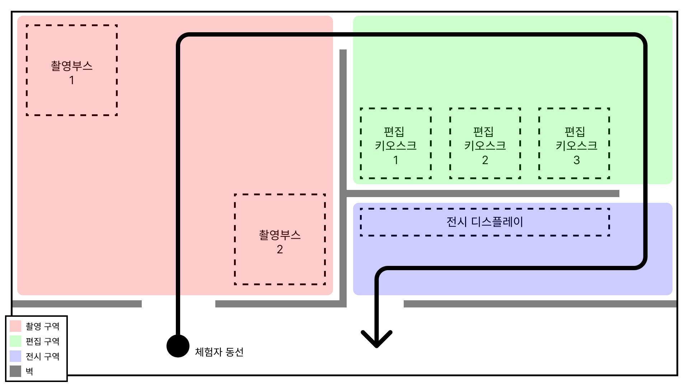
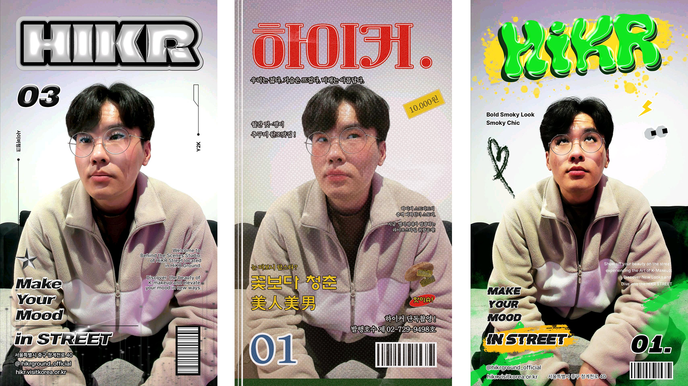

# 비하인더씬(Behind The Scene)
하이커그라운드에서 상시 운영중인 체험형 콘텐츠로 촬영→편집→전시 순서로 진행됩니다.
  
**[체험 플로우]**

  
**[최종 결과물]**

  

**[프로그램 4종 요약]**
- 촬영: 웹캠을 이용해 촬영한 이미지를 서버로 전송하고 체험 진행을 위한 고유 비밀번호를 표출
- 편집: 고유 비밀번호를 입력하여 촬영한 사진을 받고 포스트 프로세싱 필터와 페이스 마스크를 적용한 이미지를 다시 서버로 전송
- 전시: 편집된 이미지를 서버로부터 전달받아 화면에 표출
- 서버: 고유 비밀번호 및 이미지 관리

[데모 시연 영상](https://www.youtube.com/watch?v=G9FG8mV-jX0)

*실제 운영중인 버전의 리소스와 일부 기능을 덜어내고 데모버전으로 재개발하였습니다.
 
# 서버(PP_01_04_Server)
이 프로젝트는 체험의 진행을 위한 서버 프로그램입니다.
 
고유 비밀번호를 발급하며 체험 중에 발생한 이미지를 같이 관리합니다.
  
[네트워크]: TCP-Server (Telepathy 라이브러리 활용)
 
[데이터베이스]: SQLite
